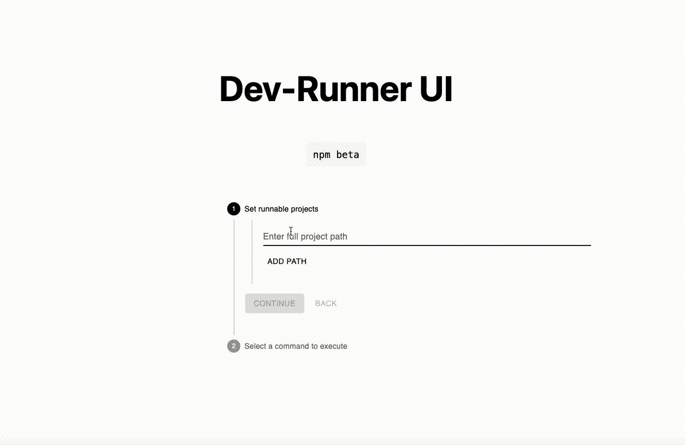

# dev-runner 

WIP




Enter a list of <= 4 local node based projects and execute concurrently via the runner ui.

Motivation - none, just for fun.. 

Disclaimer - Local dev server only, shouldn't be taken to "production", the executed get_commands
are according to the specified selected projects config files (package.json only at the moment), there's no way of running other sys commands nor injecting any scripts...

#### Runner UI 
Simple React based interface. 

#### Runner API
Local actix-web server.


### Development: 

server on watch mode: ``cargo watch -x run``

format by running: `cargo fmt`
lint by running: `cargo clippy`

frontend dev-server: ``yarn dev``

Build image + start the container: 
```shell
docker build -t rust-dev-runner .

docker run -d -p 8080:8080 rust-dev-runner
```

##### Postgres db:

Globally install diesel-cli:

``cargo install diesel_cli --no-default-features --features postgres``

Run db from container:

``docker run --rm -P -p 127.0.0.1:5432:5432 -e POSTGRES_PASSWORD="1234" --name pg postgres:alpine
``

Create migrations: 
1. `` diesel setup   ``
2. ``diesel migration generate runner``
3. ``diesel migration run`` will generate schema.rs 

Running using a CLI 

In .env set IS_CLI_MODE=true and run:

```cargo install --path . && dev-runner --help```
